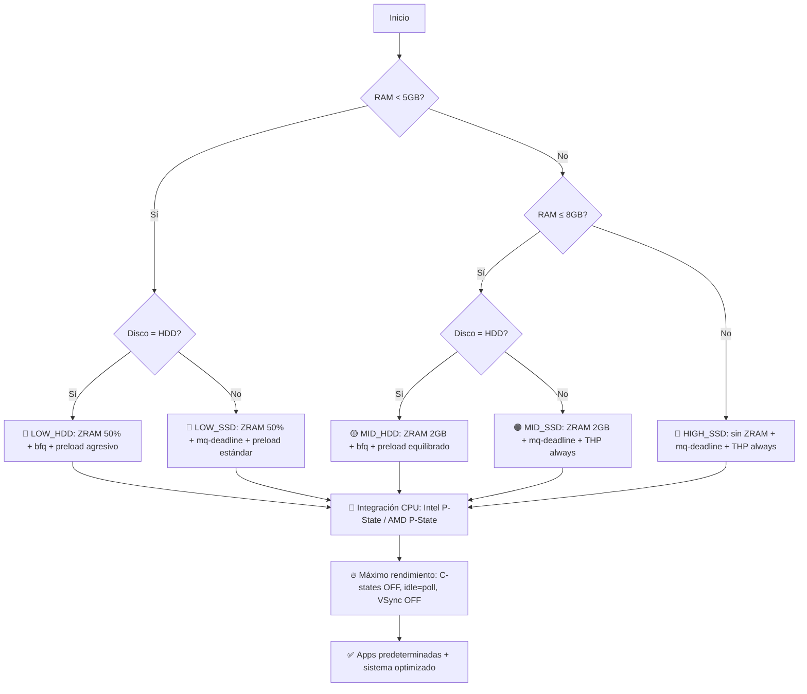

# 🐧 FlyTux Optimizer v1.0

<div align="center">


> **Optimización adaptativa para Debian/Ubuntu** — Detecta tu hardware y aplica el perfil perfecto para máximo rendimiento, ignorando límites de energía.


</div>

---

## ⚡ Resultados Esperados

| Métrica | Antes | Después FlyTux | Mejora |
|---------|-------|---------------|--------|
| **RAM idle** | 2.8-3.5 GB | **1.2-1.8 GB** | ✅ -1.5 GB libres |
| **CPU idle** | 3-8% | **0.5-1.5%** | ✅ Menos background |
| **Arranque** | 32-48 seg | **18-26 seg** | ✅ +10-20 seg más rápido |
| **Apertura de apps** | 2-4 seg | **1-2 seg** | ✅ ~40% más rápido |
| **Espacio liberado** | — | **+4-9 GB** | ✅ Sin bloatware + limpieza |

> 📊 *Pruebas en: i5-11400H / Ryzen 5 5600H, 4-16GB RAM, HDD/SSD — Debian 12 / Ubuntu 22.04*

---

## 🎯 ¿Qué hace FlyTux?

FlyTux no es un script genérico. **Detecta tu hardware real** y aplica un perfil matemáticamente optimizado:



---

## 📦 Software Instalado y Configurado como Predeterminado

| Categoría | Aplicación | Tipos de archivo asociados |
|-----------|-----------|---------------------------|
| 🌐 Navegador | **Brave Browser** | `http://`, `https://`, `.html`, `.htm` |
| 📄 Ofimática/PDF | **OnlyOffice** | `.docx`, `.xlsx`, `.pptx`, `.pdf`, `.rtf`, `.txt` |
| 🎬 Multimedia | **VLC** | `.mp4`, `.mkv`, `.webm`, `.mp3`, `.ogg`, `.avi` |
| 🖼️ Imágenes | **Nomacs** | `.jpg`, `.png`, `.gif`, `.webp`, `.bmp`, `.svg` |
| 🗜️ Compresión | **File Roller** (+ RAR/7zip) | `.zip`, `.rar`, `.7z`, `.tar`, `.gz`, `.bz2`, `.xz` |
| 🎮 Gaming | Wine/Lutris/DXVK | `.exe`, `.msi` (vía Wine), juegos de Steam/Lutris |

### Gestores de archivos comprimidos incluidos:
- ✅ **WinRAR** (`rar`, `unrar`) - Soporte nativo para archivos RAR
- ✅ **7zip** (`p7zip-full`, `p7zip-rar`) - Compresión de alta ratio, multi-formato
- ✅ **File Roller** - Integración gráfica con GNOME/KDE/XFCE
- ✅ **Herramientas CLI**: `zip`, `unzip`, `unar` para compatibilidad universal

---

## 🧩 Características Principales

### 🔍 Detección Inteligente
| Hardware Detectado | Método | Uso |
|-------------------|--------|-----|
| **RAM** | `/proc/meminfo` | Perfil LOW/MID/HIGH |
| **Disco** | `lsblk` + `sysfs/rotational` | HDD vs SSD tuning |
| **CPU Vendor** | `/proc/cpuinfo` | Intel P-State / AMD P-State |
| **Entorno Gráfico** | `loginctl` + `XDG_CURRENT_DESKTOP` | Tweaks para GNOME/KDE/XFCE/Cinnamon/MATE |

### ⚡ Optimizaciones por Perfil

| Perfil | Swappiness | ZRAM | Preload | THP | I/O Scheduler | Caso de Uso |
|--------|------------|------|---------|-----|---------------|-------------|
| **LOW_HDD** | 133 | 50% RAM (lz4) | Agresivo (cycle=5) | madvise | `bfq` | Equipos antiguos, máximo aprovechamiento |
| **LOW_SSD** | 100 | 50% RAM (lz4) | Estándar (cycle=2) | madvise | `mq-deadline` | Portátiles económicos, SSD compensa RAM |
| **MID_HDD** | 60 | 2GB (lz4) | Estándar (cycle=2) | always | `bfq` | Oficinas/estudiantes, equilibrio I/O multitarea |
| **MID_SSD** | 40 | 2GB (lz4) | Ligero (cycle=1) | always | `mq-deadline` | Gaming/creación básica, SSD permite batching |
| **HIGH_HDD** | 10 | OFF | Ligero (cycle=1) | always | `bfq` | Workstations con RAM sobrada, cuello HDD |
| **HIGH_SSD** | 1 | OFF | OFF | always | `mq-deadline` | Máximo rendimiento absoluto, latencia cero |

### 🔧 Integración Nativa CPU (Estilo macOS)

| Vendor | Tuning Aplicado | Impacto |
|--------|----------------|---------|
| **Intel** | `intel_pstate=active`, `i915.enable_guc=3`, `INTEL_DEBUG=nosync` | Escalado microsegundo, GPU integrada optimizada |
| **AMD** | `amd_pstate=active`, `amdgpu.ppfeaturemask=0xffffffff`, `RADV_PERFTEST=aco` | CPPC nativo, todos los estados de energía desbloqueados |
| **Genérico/ARM** | Tuning base universal | Compatibilidad amplia sin optimizaciones vendor-specific |

### 🔄 Asociaciones de Archivos Automáticas

El script genera automáticamente `/home/$USER/.config/mimeapps.list` y aplica asociaciones vía:
- `xdg-mime` (estándar freedesktop)
- `gio` (GNOME/Zorin)
- `kwriteconfig5` (KDE Plasma)

---

## 📋 Requisitos

```markdown
✅ Sistema Operativo:
   • Debian 11/12
   • Ubuntu 20.04/22.04/24.04
   • Linux Mint 20+/21+
   • Pop!_OS 22.04+
   • Zorin OS 16+

✅ Permisos:
   • Ejecución como root (sudo)
   • Conexión a internet (para repositorios y paquetes)

✅ Hardware recomendado:
   • Mínimo: 2GB RAM, CPU dual-core, 20GB disco libre
   • Óptimo: 4GB+ RAM, SSD, CPU moderna (Intel 8th+/AMD Ryzen)
```

---

## 🚀 Instalación y Uso

### Método 1: Descarga directa (Recomendado)
```bash
# 1. Descargar el script
wget -O FlyTux\ Optimizer.sh https://raw.githubusercontent.com/gridacorp/Linux-Optimizer/main/FlyTux%20Optimizer.sh

# 2. Hacer ejecutable
chmod +x "FlyTux Optimizer.sh"

# 3. Ejecutar como root
sudo "./FlyTux Optimizer.sh"

# 4. Reiniciar (obligatorio para aplicar cambios de kernel/GRUB)
sudo reboot
```

### Método 2: Clonar repositorio
```bash
git clone https://github.com/gridacorp/Linux-Optimizer.git
cd Linux-Optimizer
chmod +x "FlyTux Optimizer.sh"
sudo "./FlyTux Optimizer.sh"
sudo reboot
```

### Verificar que funcionó
```bash
# Ver perfil aplicado
cat /var/log/flytux-*.log | grep "Perfil aplicado"

# Ver aplicaciones predeterminadas
xdg-mime query default x-scheme-handler/https        # brave-browser.desktop
xdg-mime query default application/pdf               # onlyoffice-desktopeditors.desktop
xdg-mime query default application/zip               # file-roller.desktop

# Ver parámetros de kernel activos
cat /proc/cmdline | grep -o "idle=poll\|intel_pstate=active\|amd_pstate=active"

# Ver swappiness aplicado
cat /proc/sys/vm/swappiness
```

---

## 🔙 Cómo Revertir Cambios

FlyTux está diseñado para ser **100% reversible**. Si necesitas deshacer las optimizaciones:

```bash
# 1. Restaurar backup de configuraciones
sudo tar xzf /tmp/flytux-backup-*.tar.gz -C /

# 2. Eliminar archivos específicos de FlyTux
sudo rm -f /etc/default/grub.d/99-flytux.cfg
sudo rm -f /etc/modprobe.d/*flytux*.conf
sudo rm -f /etc/profile.d/flytux-*.sh
sudo rm -f /etc/sysctl.d/99-flytux.conf
sudo rm -f /etc/udev/rules.d/60-flytux-io.rules
sudo rm -f /etc/systemd/{journald,system.conf}.d/flytux.conf
sudo rm -f /etc/systemd/resolved.conf.d/flytux-dns.conf

# 3. Restaurar GRUB y sysctl
sudo update-grub
sudo sysctl -p /etc/sysctl.conf 2>/dev/null || true

# 4. (Opcional) Reinstalar apps eliminadas
sudo apt install firefox libreoffice-core

# 5. Reiniciar
sudo reboot
```

> 💡 **Consejo**: Guarda el archivo de backup (`/tmp/flytux-backup-*.tar.gz`) en un medio externo antes de borrarlo.

---

## ⚠️ Advertencias Importantes

> [!CAUTION]
> ### Lee antes de ejecutar
> 
> **FlyTux modifica componentes críticos del sistema**:
> - **C-states desactivados + idle=poll**: La CPU nunca entra en modo de bajo consumo → mayor consumo energético y temperatura. **No usar en portátiles con batería**.
> - **swappiness=1/10/133**: El comportamiento de swap cambia drásticamente. En LOW_RAM, el sistema prioriza ZRAM sobre disco; en HIGH_RAM, evita swap casi por completo.
> - **VSync OFF + mailbox presentation**: Máximo FPS, pero posible *screen tearing* en juegos antiguos o aplicaciones no optimizadas.
> - **AppArmor habilitado**: Puede bloquear aplicaciones no perfiladas. Usa `aa-complain` para modo auditoría si hay problemas.
> - **Telemetría bloqueada**: Algunas funciones de Ubuntu (reporte de errores, actualizaciones de drivers vía GUI) pueden no funcionar.

> [!TIP]
> ### Prueba primero en entorno controlado
> 
> Si es tu primera vez:
> 1. Ejecuta en una **máquina virtual** (VirtualBox, KVM) con snapshot
> 2. Valida que tus aplicaciones críticas funcionen
> 3. Luego aplica en producción

---

## 🔧 Solución de Problemas

| Problema | Causa Probable | Solución |
|----------|---------------|----------|
| **El script falla al inicio** | No se ejecuta como root o distro no compatible | Usar `sudo` y verificar `/etc/os-release` |
| **Asociaciones no aplican** | Sesión de usuario no reiniciada | Cerrar sesión y volver a entrar, o ejecutar `killall xdg-desktop-portal` |
| **File Roller no abre RAR** | Paquete `rar` no instalado (repositorio non-free) | Habilitar repositorio `non-free` en `/etc/apt/sources.list` |
| **Brave no aparece en menú** | Desktop entry no registrado | Ejecutar `update-desktop-database ~/.local/share/applications` |
| **GPU no aplica tuning** | Driver propietario no instalado o GPU no detectada | Instalar `nvidia-driver` o `mesa-vulkan-drivers` según corresponda |
| **Sistema más lento después** | Perfil incorrecto (ej. LOW_HDD en SSD) | Revertir y verificar detección de hardware |

### Logs de diagnóstico
```bash
# Ver errores durante la ejecución
grep -i "error\|fail" /var/log/flytux-*.log

# Ver qué perfil se aplicó
grep "Perfil aplicado" /var/log/flytux-*.log

# Ver cambios de sysctl aplicados
sysctl -a | grep -E "vm.swappiness|vm.dirty_ratio|kernel.sched"

# Ver configuración de ZRAM
zramctl

# Ver scheduler activo
cat /sys/block/*/queue/scheduler
```

---

## 🤝 Contribuir

¡Las contribuciones son bienvenidas! Sigue estos pasos:

1. **Fork** el repositorio
2. Crea una rama para tu feature: `git checkout -b feature/nueva-optimizacion`
3. Commit tus cambios: `git commit -m 'feat: agregar detección de GPU NVIDIA'`
4. Push a la rama: `git push origin feature/nueva-optimizacion`
5. Abre un **Pull Request**

### Estándares de código
- ✅ Usa `bash` (no `sh`) para compatibilidad con arrays y `[[ ]]`
- ✅ Cada sección con comentario de cabecera `# ── Título ──`
- ✅ Comandos críticos con `|| echo "⚠️ Mensaje"` para diagnóstico
- ✅ Archivos de configuración con comentario `# FlyTux Optimizer v1.0 - ...`
- ✅ Variables en MAYÚSCULAS, funciones en minúsculas_con_guiones

### Ideas para contribuir
- [ ] Agregar detección de GPU dedicada para ajustes adicionales
- [ ] Modo `--dry-run` para simular cambios sin aplicar
- [ ] Script de benchmarking pre/post (`flytux-benchmark.sh`)
- [ ] Soporte para Fedora/openSUSE (adaptar paquetes)
- [ ] Interfaz TUI simple con `dialog` o `whiptail` para usuarios que prefieren guía paso a paso

---

## 📜 Historial de Versiones

| Versión | Fecha | Cambios Clave |
|---------|-------|--------------|
| **v1.0** | Mayo 2026 | 🎉 Lanzamiento inicial: detección matricial 6 escenarios, integración nativa Intel/AMD, gaming stack, gestores RAR/7zip, apps predeterminadas, reversibilidad completa |

---

## 📄 Licencia

```
MIT License

Copyright (c) 2026 FlyTux Optimizer Contributors

Se concede permiso, gratuitamente, a cualquier persona que obtenga una copia
de este software y archivos de documentación asociados, para usar, copiar,
modificar, fusionar, publicar, distribuir, sublicenciar y/o vender copias
del Software, y permitir a las personas a quienes se les proporcione el
Software a hacerlo, sujeto a las siguientes condiciones:

El aviso de copyright anterior y este aviso de permiso se incluirán en todas
las copias o partes sustanciales del Software.

EL SOFTWARE SE PROPORCIONA "TAL CUAL", SIN GARANTÍA DE NINGÚN TIPO, EXPRESA O
IMPLÍCITA, INCLUYENDO PERO NO LIMITADO A GARANTÍAS DE COMERCIALIZACIÓN,
IDONEIDAD PARA UN PROPÓSITO PARTICULAR E INCUMPLIMIENTO. EN NINGÚN CASO LOS
AUTORES O TITULARES DEL COPYRIGHT SERÁN RESPONSABLES POR NINGUNA RECLAMACIÓN,
DAÑO U OTRA RESPONSABILIDAD, YA SEA EN UNA ACCIÓN DE CONTRATO, AGRAVIO O DE
OTRO TIPO, QUE SURJA DE, FUERA DE O EN CONEXIÓN CON EL SOFTWARE O EL USO U
OTRAS TRANSACCIONES EN EL SOFTWARE.
```

---

## 🙏 Apoya el Proyecto

FlyTux es **100% gratuito y open-source**. Si te ha sido útil, considera apoyar su desarrollo continuo:

[](https://www.paypal.com/donate/?hosted_button_id=DMREEX4NSS7V4)

O contribuye con:
- 🐛 Reportando bugs en [Issues](../../issues)
- 💡 Sugiriendo mejoras en [Discussions](../../discussions)
- 📝 Mejorando la documentación con un PR

---

<div align="center">

> 🐧 *"Haz que tu Linux vuele — sin sacrificar control ni reversibilidad."*  
> **FlyTux Optimizer v1.0** — Hecho con ❤️ para la comunidad Linux.

```bash
# ¿Listo para optimizar?
wget -qO- https://raw.githubusercontent.com/gridacorp/Linux-Optimizer/main/FlyTux%20Optimizer.sh | sudo bash
```

<p align="center">
  <sub>Última actualización: Mayo 2026 • Compatible con Debian 11/12, Ubuntu 20.04-24.04</sub><br>
  <sub>¿Problemas? Abre un <a href="../../issues">issue</a> con tu log de /var/log/flytux-*.log</sub>
</p>

</div>