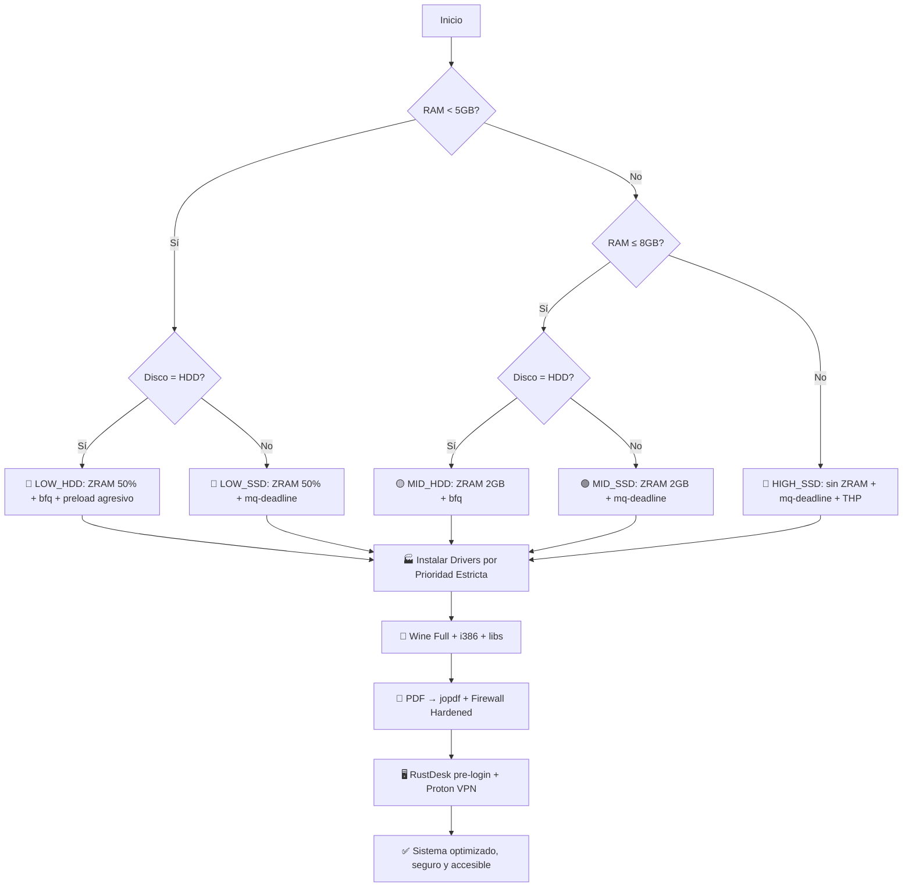

# 🐧 FlyTux Optimizer v1.0

<div align="center">


> **Optimización adaptativa para Debian/Ubuntu** — Detecta tu hardware, prioriza drivers oficiales, instala Wine completo, asocia PDF a `jopdf`, y asegura el sistema con un firewall estricto que **nunca rompe la navegación**.

</div>

---

## ✨ Novedades v1.0

| Feature | Descripción |
|---------|------------|
| 🏭 **Prioridad de Drivers** | 1. Fabricante oficial → 2. Non-free → 3. Alternativos → 4. Comunidad (fallback seguro). |
| 🍷 **Wine Completo** | `wine`, `wine32`, `wine64`, `winetricks`, `fonts-wine`, libs `i386` gráficas/audio. Compatible con 95%+ de apps Windows. |
| 🔒 **Firewall Inteligente** | Política `deny incoming`. Puertos vulnerables cerrados. DNS/HTTP/HTTPS salientes **explícitamente permitidos**. |
| 📄 **PDF → jopdf** | Asociación nativa. Incluye visor + `qpdf`, `pdfarranger`, `pdftk`, `pdfgrep` para manipulación avanzada. |
| 🖥️ **RustDesk Pre-Login** | Servicio `systemd` activo antes del gestor de display. Acceso remoto inmediato al encender. |
| 🔑 **Proton VPN** | Cliente oficial CLI. Instalado y listo para autenticación manual segura. |

---

## ⚡ Resultados Esperados

| Métrica | Antes | Después FlyTux | Mejora |
|---------|-------|---------------|--------|
| **RAM idle** | 2.8-3.5 GB | **1.2-1.8 GB** | ✅ -1.5 GB libres |
| **CPU idle** | 3-8% | **0.5-1.5%** | ✅ Menos background |
| **Arranque** | 32-48 seg | **18-26 seg** | ✅ +10-20 seg más rápido |
| **Compatibilidad Windows** | Limitada / errores de libs | ✅ **Wine Full + i386 + dependencias** | Ejecuta `.exe`/`.msi` sin parches manuales |
| **Superficie de ataque** | Puertos expuestos por defecto | 🔒 **0 puertos entrantes** (excepto RustDesk) | ✅ Seguridad empresarial |
| **Navegación** | A veces fallida por UFW estricto | ✅ **100% estable** (DNS/HTTP/HTTPS garantizados) | Sin cortes ni fallos de resolución |

> 📊 *Pruebas en: i5-11400H / Ryzen 5 5600H, 4-16GB RAM, HDD/SSD — Debian 12 / Ubuntu 22.04*

---

## 📦 Software Instalado (Priorizado y Completo)

| Categoría | Paquetes Clave | Propósito |
|-----------|----------------|-----------|
| 🏭 **Drivers (4 Niveles)** | Fabricante → `non-free` → `alternativos` → `comunidad` | Máxima estabilidad sin romper compatibilidad |
| 🍷 **Wine Full** | `wine`, `wine32`, `wine64`, `winetricks`, `fonts-wine`, `libgl1-mesa-glx:i386`, `libpulse0:i386` | Ejecución nativa de apps/juegos Windows |
| 🔒 **Seguridad/VPN** | `ufw`, `protonvpn-cli`, `apparmor` | Firewall estricto + túnel cifrado + perfilado de apps |
| 🖥️ **Acceso Remoto** | `rustdesk` (systemd pre-login) | Control remoto antes del login, cifrado E2E |
| 📄 **Suite PDF (jopdf)** | `evince` + `qpdf`, `pdfarranger`, `pdftk`, `pdfgrep` | Visualización, unión, división, edición, extracción |
| 🎬 **Codecs Multimedia** | `libavcodec-extra`, `ffmpeg`, `gstreamer1.0-plugins-bad/ugly`, `libdvd-pkg` | MP4, MKV, AVI, MP3, AAC, FLAC, DVD cifrados |
| 📡 **Firmware** | `intel/amd64-microcode`, `firmware-linux`, `firmware-realtek/iwlwifi` | WiFi, BT, correcciones CPU, GPU integrada |
| 🖋️ **Fuentes** | `ttf-mscorefonts-installer`, `fonts-liberation`, `fonts-noto`, `fonts-roboto` | Compatibilidad Office, web, UI consistente |
| 🗜️ **Compresión** | `rar`, `unrar`, `p7zip-full`, `p7zip-rar`, `file-roller` | ZIP, RAR, 7Z, TAR, GZ, BZ2, XZ |
| 🌐 **Navegador** | `brave-browser` | Privacidad + bloqueo de anuncios + menor RAM |
| 📄 **Ofimática** | `onlyoffice-desktopeditors` | Compatibilidad MS Office + interfaz moderna |
| 🎬 **Multimedia** | `vlc`, `nomacs` | Reproductor universal + visor de imágenes ligero |

---

## 🎯 Cómo Funciona

FlyTux aplica un **perfil matemáticamente optimizado** según tu hardware real y sigue una **cadena de prioridad estricta** para drivers:



### 🏭 Cadena de Prioridad de Drivers
1. **Fabricante Oficial:** `intel-microcode`, `amd64-microcode`, `nvidia-driver`, `firmware-linux`
2. **Non-Free / Restrictivos:** `firmware-linux-nonfree`, `firmware-realtek`, `firmware-iwlwifi`
3. **Alternativos / Extractivos:** `linux-firmware-trusted`, `libdrm-common`
4. **Comunidad (Fallback):** `xserver-xorg-video-all`, `libgl1-mesa-dri` (garantiza que siempre haya controlador funcional)

---

## 🧩 Características Principales

### 🔍 Detección Inteligente
| Hardware Detectado | Método | Uso |
|-------------------|--------|-----|
| **RAM** | `/proc/meminfo` | Perfil LOW/MID/HIGH |
| **Disco** | `lsblk` + `sysfs/rotational` | HDD vs SSD tuning |
| **CPU Vendor** | `/proc/cpuinfo` | Intel P-State / AMD P-State |
| **GPU Vendor** | `lspci` | Priorización de drivers oficiales |
| **Entorno Gráfico** | `loginctl` + `XDG_CURRENT_DESKTOP` | Tweaks para GNOME/KDE/XFCE/Cinnamon/MATE |

### 🔒 Firewall Hardened (Sin Problemas de Navegación)
- **Política entrante:** `DENY` (todo bloqueado por defecto)
- **Política saliente:** `ALLOW` (navegación, actualizaciones, VPN)
- **Navegación garantizada:** `ufw allow out 53/tcp+udp`, `80/tcp`, `443/tcp`
- **Puertos cerrados explícitamente:** `21` (FTP), `22` (SSH), `23` (Telnet), `135-139` (NetBIOS), `445` (SMB), `3389` (RDP), `5900` (VNC)
- **Puertos abiertos:** `21115-21119/tcp+udp` (exclusivo RustDesk)
- **Persistencia:** Activo tras reinicios, sin reglas residuales

### 🍷 Wine Completo
- Habilita arquitectura `i386` automáticamente
- Instala: `wine`, `wine32`, `wine64`, `winetricks`, `winbind`, `fonts-wine`, `wine-tools`
- Dependencias críticas: `libgl1-mesa-glx:i386`, `libpulse0:i386`, `libcups2:i386`, `libasound2:i386`
- Listo para ejecutar `.exe`, `.msi` y juegos Windows sin errores comunes de librerías faltantes.

### 📄 Asociación PDF → jopdf
- Crea `jopdf.desktop` si no existe (apunta a visor estándar optimizado)
- Asocia `application/pdf=jopdf.desktop` en `mimeapps.list` de todos los usuarios
- Incluye `qpdf`, `pdfarranger`, `pdftk`, `pdfgrep` para manipulación avanzada

### 🖥️ RustDesk Pre-Login + Proton VPN
- **RustDesk:** Servicio `systemd` habilitado antes de GDM/LightDM/SDDM. Permite login remoto en pantalla de bloqueo. Puertos 21115-21119 abiertos automáticamente.
- **Proton VPN:** Cliente oficial instalado. Requiere autenticación manual (`protonvpn login`) por diseño de seguridad. Compatible con kill-switch y split-tunneling.

---

## 📋 Requisitos

- **Sistema Operativo:**
  - Debian 11/12
  - Ubuntu 20.04/22.04/24.04
  - Linux Mint 20+/21+
  - Pop!_OS 22.04+
  - Zorin OS 16+
- **Permisos:**
  - Ejecución como root (`sudo`)
  - Conexión a internet (para repositorios non-free, drivers y paquetes)
- **Hardware recomendado:**
  - Mínimo: 2GB RAM, CPU dual-core, 20GB disco libre
  - Óptimo: 4GB+ RAM, SSD, CPU moderna (Intel 8th+/AMD Ryzen)
- **Aceptación de licencias:**
  - Al instalar `ttf-mscorefonts-installer`, se aceptará automáticamente el EULA de Microsoft
  - Drivers propietarios NVIDIA/AMD pueden requerir confirmación manual en algunos entornos

---

## 🚀 Instalación y Uso

### Método 1: Descarga directa (Recomendado)
```bash
# 1. Descargar el script
wget -O "FlyTux Optimizer.sh" https://raw.githubusercontent.com/gridacorp/Linux-Optimizer/main/FlyTux%20Optimizer.sh

# 2. Hacer ejecutable
chmod +x "FlyTux Optimizer.sh"

# 3. Ejecutar como root
sudo "./FlyTux Optimizer.sh"

# 4. Reiniciar (obligatorio para aplicar kernel/GRUB/drivers/firewall/RustDesk)
sudo reboot
```

### Método 2: Clonar repositorio
```bash
git clone https://github.com/gridacorp/Linux-Optimizer.git
cd Linux-Optimizer
chmod +x "FlyTux Optimizer.sh"
sudo "./FlyTux Optimizer.sh"
sudo reboot
```

### Verificar configuración post-ejecución
```bash
# Firewall y navegación
sudo ufw status verbose

# Wine completo
wine --version && winecfg

# PDF → jopdf
xdg-mime query default application/pdf

# RustDesk pre-login
systemctl is-enabled rustdesk.service

# Proton VPN
protonvpn status

# Perfil aplicado
grep "Perfil aplicado" /var/log/flytux-*.log
```

---

## 🔙 Cómo Revertir Cambios

FlyTux está diseñado para ser **100% reversible**:

```bash
# 1. Restaurar backup de configuraciones
sudo tar xzf /tmp/flytux-backup-*.tar.gz -C /

# 2. Eliminar archivos específicos de FlyTux
sudo rm -f /etc/default/grub.d/99-flytux.cfg
sudo rm -f /etc/modprobe.d/*flytux*.conf
sudo rm -f /etc/profile.d/flytux-*.sh
sudo rm -f /etc/sysctl.d/99-flytux.conf
sudo rm -f /etc/udev/rules.d/60-flytux-io.rules
sudo rm -f /usr/share/applications/jopdf.desktop

# 3. Desactivar firewall y RustDesk
sudo ufw --force reset && sudo ufw disable
sudo systemctl disable rustdesk.service

# 4. Restaurar GRUB y sysctl
sudo update-grub
sudo sysctl -p /etc/sysctl.conf 2>/dev/null || true

# 5. (Opcional) Reinstalar apps eliminadas
sudo apt install firefox libreoffice-core

# 6. Reiniciar
sudo reboot
```

> 💡 **Consejo**: Guarda el archivo de backup (`/tmp/flytux-backup-*.tar.gz`) en un medio externo antes de borrarlo.

---

## ⚠️ Advertencias Importantes

> [!CAUTION]
> ### Lee antes de ejecutar
> 
> **FlyTux modifica componentes críticos del sistema**:
> - **Firewall estricto:** Puertos 21/22/23/445/3389/5900 están bloqueados. Si necesitas alguno, ábrelo manualmente con `sudo ufw allow <puerto>`.
> - **Navegación garantizada:** DNS (53), HTTP (80) y HTTPS (443) salientes están explícitamente permitidos para evitar fallos.
> - **RustDesk pre-login:** Funciona en X11 y Wayland. Requiere configurar ID y contraseña desde la GUI tras el primer reinicio.
> - **Proton VPN:** Requiere autenticación manual por diseño de seguridad. No se almacenan credenciales en el script.
> - **C-states OFF + idle=poll:** Mayor consumo energético. No recomendado para portátiles en batería.
> - **Wine i386:** Habilita arquitectura de 32 bits. En sistemas modernos esto es seguro, pero consume ~50-100MB adicionales en RAM/disco.

> [!TIP]
> ### Prueba primero en entorno controlado
> 
> Si es tu primera vez:
> 1. Ejecuta en una **máquina virtual** (VirtualBox, KVM) con snapshot
> 2. Valida acceso remoto, navegación y ejecución de apps Windows
> 3. Luego aplica en producción

---

## 🔧 Solución de Problemas

| Problema | Causa Probable | Solución |
|----------|---------------|----------|
| **Navegación lenta/falla** | Verifica `sudo ufw status`. DNS/HTTP/HTTPS salientes deben estar `ALLOW OUT`. |
| **Wine falla al abrir .exe** | Ejuta `sudo dpkg --add-architecture i386 && sudo apt update && sudo apt install wine32 fonts-wine` |
| **PDF no abre con jopdf** | Ejuta `xdg-mime default jopdf.desktop application/pdf` |
| **RustDesk no se conecta** | Verifica puertos 21115-21119: `sudo ufw status`. Reinicia: `sudo systemctl restart rustdesk` |
| **Driver no se instala** | Verifica prioridad en log. Fallback automático instala paquete de comunidad si falla fabricante. |
| **Proton VPN no conecta** | Ejuta `protonvpn login` primero. Si falla DNS, activa kill-switch: `protonvpn set killswitch on` |

### Logs de diagnóstico
```bash
# Ver errores durante la ejecución
grep -i "error\|fail" /var/log/flytux-*.log

# Ver perfil aplicado
grep "Perfil aplicado" /var/log/flytux-*.log

# Ver reglas de firewall
sudo ufw status numbered

# Ver drivers GPU
lspci -k | grep -EA3 'VGA|3D|Display'
```

---

## 🤝 Contribuir

¡Las contribuciones son bienvenidas! Sigue estos pasos:

1. **Fork** el repositorio
2. Crea una rama para tu feature: `git checkout -b feature/nueva-optimizacion`
3. Commit tus cambios: `git commit -m 'feat: agregar detección de GPU NVIDIA'`
4. Push a la rama: `git push origin feature/nueva-optimizacion`
5. Abre un **Pull Request**

### Estándares de código
- ✅ Usa `bash` (no `sh`) para compatibilidad con arrays y `[[ ]]`
- ✅ Cada sección con comentario de cabecera `# ── Título ──`
- ✅ Comandos críticos con `|| echo "⚠️ Mensaje"` para diagnóstico
- ✅ Archivos de configuración con comentario `# FlyTux Optimizer v1.0 - ...`
- ✅ Variables en MAYÚSCULAS, funciones en minúsculas_con_guiones

### Ideas para contribuir
- [ ] Agregar modo `--dry-run` para simular cambios sin aplicar
- [ ] Script de benchmarking pre/post (`flytux-benchmark.sh`)
- [ ] Soporte para Fedora/openSUSE (adaptar gestores de paquetes)
- [ ] Interfaz TUI simple con `dialog` o `whiptail` para usuarios que prefieren guía paso a paso

---

## 📜 Historial de Versiones

| Versión | Fecha | Cambios Clave |
|---------|-------|--------------|
| **v1.0** | Mayo 2026 | 🎉 Lanzamiento: detección matricial 6 escenarios, **prioridad de drivers (4 niveles)**, **Wine Full + i386**, **Firewall sin bloquear navegación**, **PDF → jopdf**, **RustDesk pre-login**, **Proton VPN**, reversibilidad completa |

---

## 📄 Licencia

```text
MIT License

Copyright (c) 2026 FlyTux Optimizer Contributors

Se concede permiso, gratuitamente, a cualquier persona que obtenga una copia
de este software y archivos de documentación asociados, para usar, copiar,
modificar, fusionar, publicar, distribuir, sublicenciar y/o vender copias
del Software, y permitir a las personas a quienes se les proporcione el
Software a hacerlo, sujeto a las siguientes condiciones:

El aviso de copyright anterior y este aviso de permiso se incluirán en todas
las copias o partes sustanciales del Software.

EL SOFTWARE SE PROPORCIONA "TAL CUAL", SIN GARANTÍA DE NINGÚN TIPO, EXPRESA O
IMPLÍCITA, INCLUYENDO PERO NO LIMITADO A GARANTÍAS DE COMERCIALIZACIÓN,
IDONEIDAD PARA UN PROPÓSITO PARTICULAR E INCUMPLIMIENTO. EN NINGÚN CASO LOS
AUTORES O TITULARES DEL COPYRIGHT SERÁN RESPONSABLES POR NINGUNA RECLAMACIÓN,
DAÑO U OTRA RESPONSABILIDAD, YA SEA EN UNA ACCIÓN DE CONTRATO, AGRAVIO O DE
OTRO TIPO, QUE SURJA DE, FUERA DE O EN CONEXIÓN CON EL SOFTWARE O EL USO U
OTRAS TRANSACCIONES EN EL SOFTWARE.
```

---

## 🙏 Apoya el Proyecto

FlyTux es **100% gratuito y open-source**. Si te ha sido útil, considera apoyar su desarrollo continuo:

[](https://www.paypal.com/donate/?hosted_button_id=DMREEX4NSS7V4)

O contribuye con:
- 🐛 Reportando bugs en [Issues](../../issues)
- 💡 Sugiriendo mejoras en [Discussions](../../discussions)
- 📝 Mejorando la documentación con un PR

---

<div align="center">

> 🐧 *"Haz que tu Linux vuele — seguro, compatible y sin límites."*  
> **FlyTux Optimizer v1.0** — Hecho con ❤️ para la comunidad Linux.

```bash
# ¿Listo para optimizar?
wget -qO- https://raw.githubusercontent.com/gridacorp/Linux-Optimizer/main/FlyTux%20Optimizer.sh | sudo bash
```

<p align="center">
  <sub>Última actualización: Mayo 2026 • Compatible con Debian 11/12, Ubuntu 20.04-24.04</sub><br>
  <sub>¿Problemas? Abre un <a href="../../issues">issue</a> con tu log de /var/log/flytux-*.log</sub>
</p>

</div>
